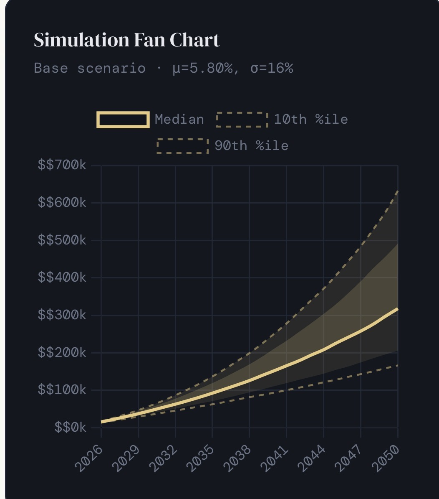

# Monte Carlo Retirement Forecast Dashboard

A retirement forecasting tool that simulates **10,000 possible market outcomes** to estimate long-term investment growth and retirement probabilities.

This project uses **Monte Carlo simulation** to model potential portfolio paths from **2026 to 2050**, helping investors visualize best-case, worst-case, and median outcomes.

---

## Simulation Fan Chart

The chart below shows the projected range of portfolio outcomes under simulated market conditions.

The **median line** represents the most likely portfolio growth path, while the shaded area shows the **10th to 90th percentile range** of outcomes across 10,000 simulated market paths.

---

## Key Features

• 10,000 Monte Carlo retirement simulations  
• Bear, Base, and Bull market scenarios  
• Probability tracker for retirement milestones  
• Visual fan chart showing uncertainty range  
• Historical return assumptions built into the model  
• Runs locally in any browser

---

## Simulation Details

**Projection period:** 2026–2050  
**Base return assumption (μ):** 5.8%  
**Market volatility (σ):** 16%  

The model generates thousands of potential return paths to estimate the probability of reaching different retirement targets.

---

## Example Retirement Targets

The simulation estimates probabilities of reaching:

• $100k portfolio  
• $250k portfolio  
• $500k portfolio  
• $1M portfolio  

---

## Interactive Dashboard

The full interactive dashboard can be accessed here:

https://datainfamous.gumroad.com/l/qelavr

The dashboard runs locally as a **single HTML file** and allows users to explore different return assumptions and retirement scenarios.

---

## Technologies Used

• Monte Carlo Simulation  
• Financial Modeling  
• Data Visualization  
• JavaScript / HTML  
• Statistical Forecasting

---

## Author

**Benjamyn Wilson**

Data Science Student  
Financial Modeling & Simulation Projects
